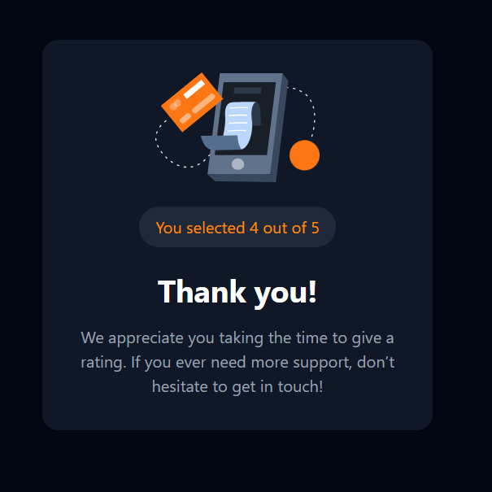

# Interactive rating component

# Frontend Mentor - Interactive rating component solution

This is a solution to the [Interactive rating component challenge on Frontend Mentor](https://www.frontendmentor.io/challenges/interactive-rating-component-koxpeBUmI). Frontend Mentor challenges help you improve your coding skills by building realistic projects. 

## Table of contents

- [Overview](#overview)
  - [The challenge](#the-challenge)
  - [Screenshot](#screenshot)
  - [Links](#links)
- [My process](#my-process)
  - [Built with](#built-with)
  - [What I learned](#what-i-learned)
  - [Continued development](#continued-development)
- [Author](#author)

## Overview

### The challenge

Users should be able to:

- View the optimal layout for the app depending on their device's screen size
- See hover states for all interactive elements on the page
- Select and submit a number rating
- See the "Thank you" card state after submitting a rating

### Screenshot

### Links

- Solution URL: (https://github.com/SyedSami90/Interactive-rating-component)
- Live Site URL: (https://syedsami90.github.io/Interactive-rating-component/)

## My process

### Built with

- Semantic HTML5 markup
- Tailwind
- Javascript
- Flexbox
- Mobile-first workflow

### What I learned

This is the first time in which I used tailwind and javscript together to create an interactive page. There are many things that I learned how to make the page responsive in TW,making simple js algorithms and more

### Continued development

Using custom fonts

## Author

- Frontend Mentor - (https://github.com/SyedSami90)

